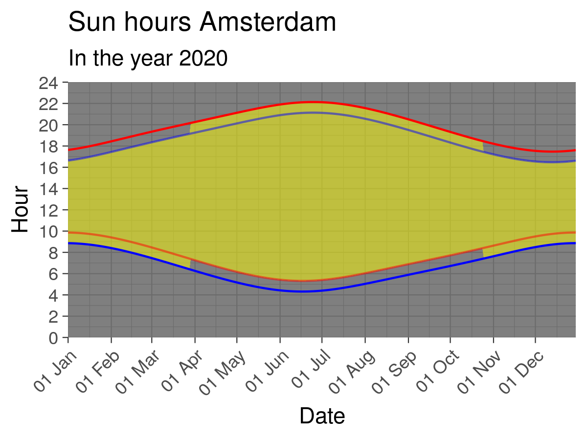

# Daylight distribution in the European Union 
Interactive applet showing the daylight distribution in every UE city with a population of 100000 r larger, ignoring twilight effects. Interactive applet available in [Shinyapps][app]

[][app]

## Static images
If preferred, static images corresponding to different cities can be found in [`figs/<region>`](https://github.com/PabRod/daylight-charts/tree/master/figs).



The blue lines correspond with the sunrise and sunset in <span style="color: blue;">winter time</span>. The red lines, in <span style="color: red;">summer time</span>. The shaded yellow area corresponds with the <span style="color: gold;">dual clock</span> situation.

# Usage

## In Shinyapps
An interactive version of the code can be found in [Shinyapps][app].

## Locally
1. Clone or download + unzip the code.
2. Open the `.Rproj` file with _RStudio_.
3. Execute `shiny::runApp()` for running the interactive app locally.
4. For plotting static images, use:

```r
source("auxs.R") # May require installing missing packages
plot_static_city("Madrid")
```

# More information
See essay in [Naukas.com](https://fuga.naukas.com/2018/09/02/interactivo-como-me-afecta-el-cambio-de-hora/) (in Spanish).

[app]: https://pabrod.shinyapps.io/cambio-de-hora/
